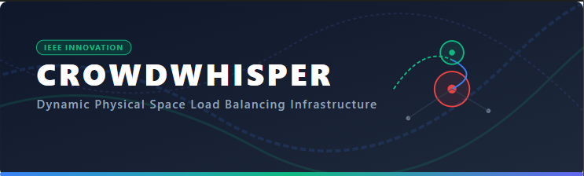

<div align="center">
  
</div>

# **Crowd Whisper**
### **Dynamic Physical Space Load Balancing System for Heritage Site Conservation**

[](https://tourist-55rr.onrender.com/)
[](https://github.com/Ginura1256/tourist.git)
[](https://mongodb.com)

Crowd Whisper is an automated, real-time spatial load-balancing platform designed to mitigate localized overtourism at high-density cultural and ecological heritage sites (e.g., Sigiriya, Temple of the Tooth, Galle Fort). 

Unlike traditional travel applications that rely on historical data to enforce *time-shifting* (altering a user's calendar), Crowd Whisper operates as an active, in-transit network interceptor executing *space-shifting*—autonomously rerouting incoming traveler traffic to under-utilized nearby attractions when an infrastructure asset's carrying capacity is breached.

---

## 🚀 Core Features & Logic Flow

1. **Live Congestion Evaluation:** The backend constantly monitors data feeds tracking immediate destination access corridors.
2. **Autonomous Interception:** If a chokepoint is flagged as congested, the frontend intercepts the user’s active navigation stream and presents an alternative route/holding pattern destination (e.g., diverting from Sigiriya to Pidurangala Rock).
3. **Stateful Looping:** The platform runs a continuous stateful validation loop monitoring the primary site.
4. **Automated Callback:** Once the primary infrastructure clears, a push notification automatically recalls the user to resume their original journey, preserving their baseline travel intent.

---

## 🛠️ Tech Stack & Telemetry

* **Frontend:** React.js, Tailwind CSS
* **Backend:** Node.js, Express.js
* **Database:** MongoDB
* **Primary Telemetry Engine:** Google Maps Routes API (v2)

### Current Prototype Scope (Phase 1 Validation)
To achieve commercial feasibility and validate the architectural data pipeline, this Phase 1 prototype utilizes **vehicular routing duration deltas** as a predictive proxy for pedestrian crowding. The Express backend compares active live-traffic duration against static, empty-road baselines to generate a proprietary *Congestion Ratio* before pushing state changes to the React user interface.

---

## 📈 Engineering Roadmap (Phase 2)

* [x] **Responsive Mobile Layout & Toggle:** Dynamically detects mobile vs PC viewports to split dashboard cards, active maps, and controls into a clean tab-switching menu and responsive header drawer.
* [ ] **Asynchronous Polling Engine:** Move API consumption away from direct frontend interactions by decoupling it via a `node-cron` worker service on the Express backend.
* [ ] **Time-Series Data Smoothing:** Persist historical polling logs to MongoDB and implement a 15-minute *Simple Moving Average (SMA)* filter to smooth out raw traffic spikes and eliminate false detour alerts.
* [ ] **B2B2G Data Pivot:** Partner with national tourism authorities (SLTDA) to substitute vehicular API proxies with direct, anonymized cellular location heatmaps (LBS) from telecommunication providers.

---

## 🔒 Administrator Portal & Simulator Sandbox

To protect manual telemetry overrides and database seeding controls from public access, Phase 1 features a secure Admin Gateway:
- **Route:** `/admin/login` (or `/admin/dashboard` once authenticated).
- **Default Credentials:**
  - **Username:** `admin`
  - **Password:** `admin123`
- **Protected Actions:** The manual crowd slider override (`/api/set-crowd`) and database seed reset (`/api/reset`) now require a valid admin session bearer token.

---

## 💻 Local Installation & Setup

### Prerequisites
* Node.js (v18+ recommended)
* MongoDB Atlas Account or Local Instance
* Google Cloud Console Account (with Routes API v2 enabled)

### 1. Clone the Repository
```bash
git clone https://github.com/Ginura1256/tourist.git
cd tourist
```

### 2. Configure Environment Variables
Create a `.env.local` file in the root directory and add the following keys:
```env
PORT=3000
MONGODB_URI=your_mongodb_connection_string
ROUTES_API_KEY=your_google_routes_api_key
```

### 3. Install & Start Development Server
```bash
npm install
npm run dev
```

The application will launch on `http://localhost:3000`.
